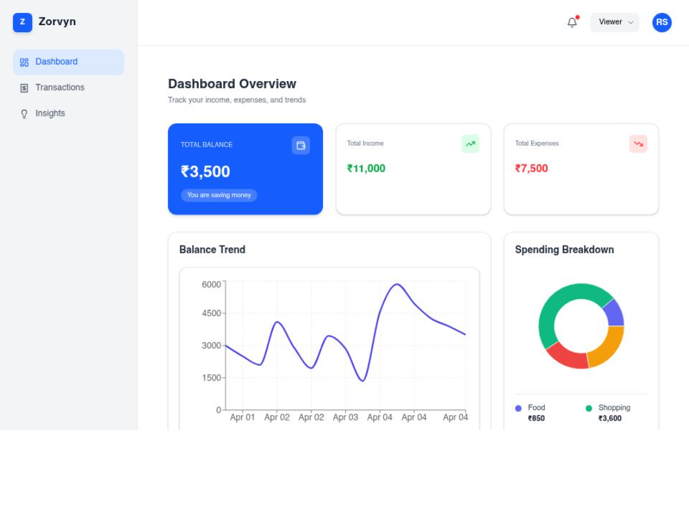

# Finance Dashboard — Zorvyn

A modern, responsive finance dashboard to track income, expenses, and financial insights with a clean and intuitive UI.

 🌐 **Live Demo:** [View Zorvyn Dashboard](https://finance-dashboard-eight-blush.vercel.app/)
 


---
##  Features

### Dashboard Overview

* Real-time balance tracking
* Income vs Expense summary
* Interactive charts (Line + Pie)

### Transactions Management

* Add, edit, delete transactions
* Smart filtering & sorting
* Search by category

### Insights

* Top spending category detection
* Monthly comparison analysis
* Income vs expense ratio insights

### Role-Based Access

* **Admin** → Full control (add/edit/delete)
* **Viewer** → Read-only mode

---

##  Tech Stack

* **Frontend:** Next.js, TypeScript
* **Styling:** Tailwind CSS
* **State Management:** Zustand
* **Charts:** Recharts
* **Icons:** Lucide React
* **Deployment:** Vercel

---

## ⚙️ Installation

1. **Install Dependencies**
   ```bash
   npm install
   ```

2. **Start the Development Server**
   ```bash
   npm run dev
   ```

3. **Build for Production**
   ```bash
   npm run build
   ```


---

## 🚀 Deployment

Deployed on **Vercel** for fast and seamless performance.

---

## 💡 Highlights

* Clean UI with smooth animations
* Optimized state management using Zustand
* Modular and scalable component structure
* Real-world dashboard experience

---


